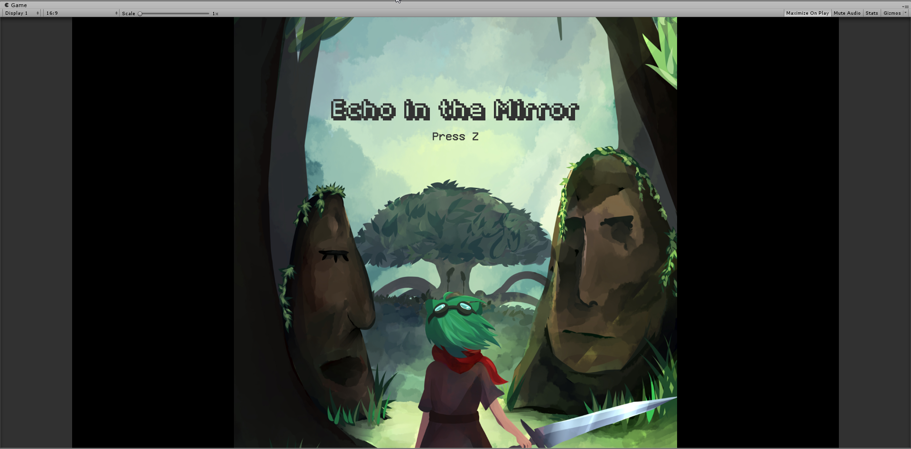

[Site Link](https://gamespawn.github.io/projects/Echo_In_The_Mirror.html)

##### *The main menu.*

My first foray into gamedev! I learned a lot through this project, not just programming stuff, but about gamedev in general as the team lead. 

As the sole programmer, I implemented input, combat, enemy AI, levels, and pretty much everything else coding-wise. Putting together asynchronous programming and state machines in my first year was pretty cool, despite being a little rough around the edges. I ended up using those primarily for character state handling and effects like invicibility flashing.

##### *Designing things to make them feel right was also something new- I spent a while making it so running into hitboxes happened less.*

There's quite a big difference between having the concept of 'making your code reusable' told to you and actualy putting it into practice, especially when your only examples up to that point were contrived examples made up in first-year college classes. I tried leaning hard on inheritance, in order to have the 'call a function and the implementing class decides the functionality' kind of pattern. 

However, that ended up not working out nearly as well as later efforts that used interfaces and composition. I ended up with a tangly mess of inherited classes that were tightly coupled with each other and it generally just didn't look pretty.

With my first project also being my first time leading a group of people to make a game, I also ran into a bunch of first-time mistakes. While I ended up with an okay level of a game by the end of it, there was quite a bit of scope creep involved, particularly on the programming side. \(How was I supposed to know that you can't learn shaders in a week by myself?\) 

In the end, I learned a lot about giving myself the leeway to learn and especially figuring *how* to learn effectively.