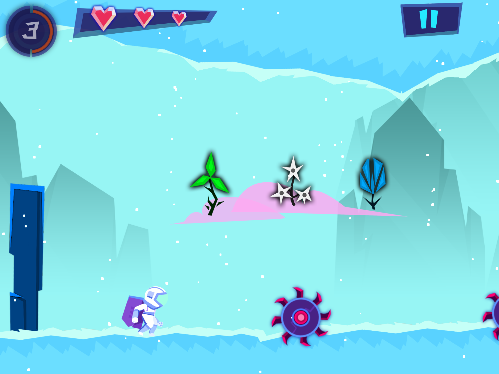

[Site Link](https://braingamecenter.ucr.edu/games/recollect/)

This is my first time working with other programmers on a large codebase! It also marks a time where I learned how to use git properly and the concepts behind version control.

##### *The menu to choose levels from.*

At the Brain Game Center, it was quite a different environment than my first project. We had style guides, pull requests, and proper branches for the different versions of the game. As a game designed less for fun and more to get data from people, my work was focused less on gameplay mechanics but rather modifying the game in for whatever research experiments the Brain Game Center wanted to perform.

##### *You would remember up to 'n' number of gems backwards and collect the one 'n' back in the sequences.*

For the experiment I was working on, we had a few directions we wanted to take the game, but all of them revolved having additional goals to the core gameplay. They worked similar to 'daily quests' in a normal video game, where the intent was to see how having that secondary motivation (beyond just trying to get good at memorization) affect people's ability to train their memory in the game. I ended up coding both the backend that tracked and recorded all this data, as well as integrating the front-end to the existing game.

At its most ambitious, we had a whole system planned where completed quests would provide coins that you could redeem for cosmetic options, which were implemented by a coworker of mine. However, the entire experiment was abandoned after the grad student heading it left for a different research lab. It was still a valuable place to gain experience in a more formal environment, however.

