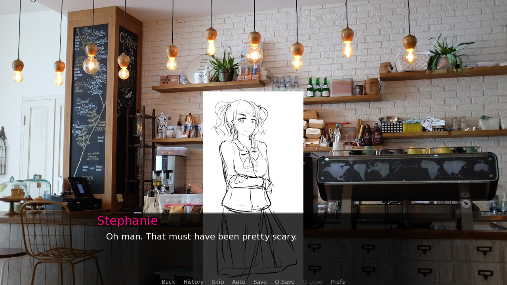
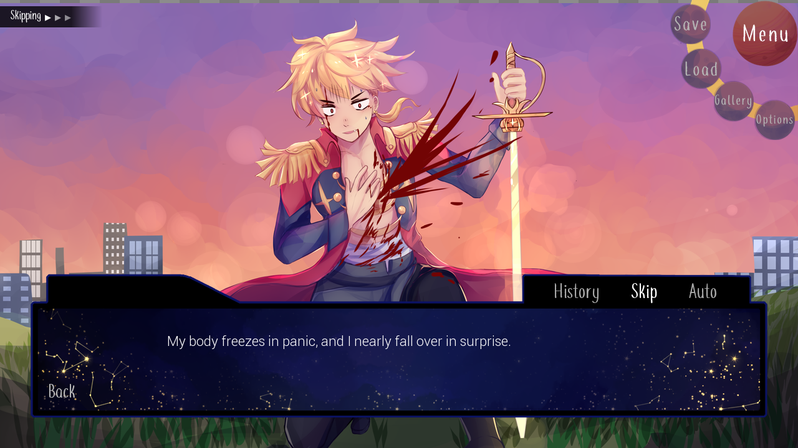

[Download link](https://rainbowjellie.itch.io/star)

Branching out into story-focused games, a friend and I did a game jam. It was our first foray into a writing for a story focused games and using Ren'Py. It also made for a nice exploration in some UI programming.

##### *A screenshot from during the game jam.*

Since we joined the jam with about two weeks left on the clock (oops), it came down to figuring out how much we could get out with our inexperience in writing for that amount of time. It was a fun but also a little grueling writing out a bunch of story in such a small period of time.

##### *We went back and added some extra stuff to our game jam build, including new routes and a custom UI.*

Afterwards, we worked on it and off for the next year afterward, with a musician helping us out as well. I went and implemented some new UI using Ren'Py's screen and UI language, which I found was pretty similar to HTML and CSS in the way that elements were described in code and then styled somewhere else. I made the UI you see above as well as implemented a simple gallery to check out all of the unlocked character art that the player has seen.

As it currently stands, we've finished the first chapter for all of our main love interests and are fine with stopping there. In the future, maybe we'd revisit this game as a more than just a visual novel but it was a cool side project to learn stuff that wasn't just pure programming, like some UI programming and design, as well as writing of course.