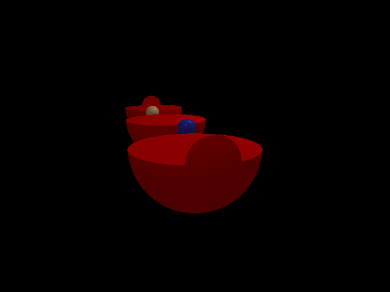
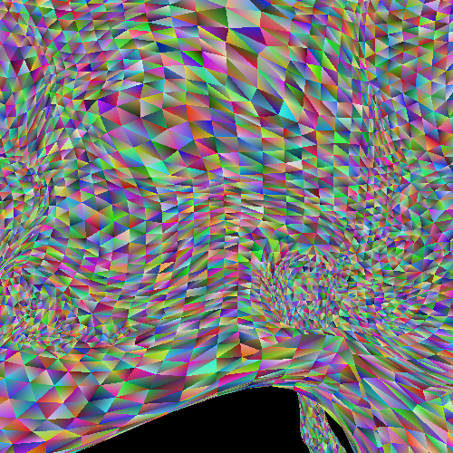

Compared to the rest of the projects on this list, these two are mostly guided academic projects for my Intro to Computer Graphics class. While not completely a passion project, it did teach me a lot about the graphics pipline and the contexts for how shaders and raytracing are used in games.

##### *Ray-traced spheres defined through boolean subtraction.*

The first project was a ray tracer that rendered an image from a input file of primitives like spheres, planes, and toruses. A lot of the work was figuring out the math in order to calculate a ray intersection on these primitives. I also implemented lighting in the form of Phong shading and shadowing, using the same math from earlier to calculate light visibility. Lastly, adding boolean modifiers to join/intersection/subtract these primitives was a little tough to combine with everything else, but I managed in the end.

##### *A wall of rasterized triangle meshes.*

The second half of the class focused around rasterizing triangles from given triangle vertex and color inputs. It centered around implementing a roughly simplified graphics pipeline from start to finish. Vertices were put into clip space, input into a vertex shader, and then put into a fragment shader to output color. While we didn't do texture mapping, we did at least perform color interpolation with barycentric coordinates.

This project and my later experiments in shaders really solidifed my interested in graphics and shader programming. I'm nowhere near close to learning everything, but getting that glimpse into how things work made a lot of sense to me and made me want to continue this journey.