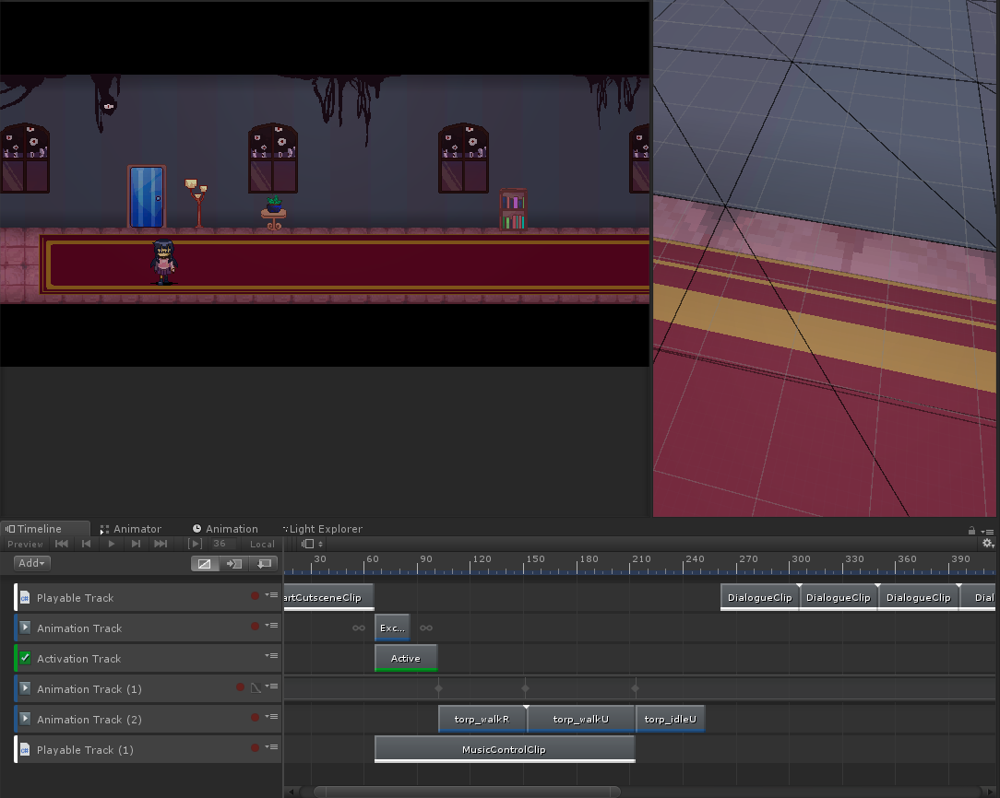
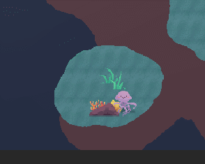

[Download link](https://rainbowjellie.itch.io/oceans-demise)

Of all the projects I've done in school so far, this is probably the most ambitious one, both in terms of size but also in terms of sheer things I had to learn along the way. A lot of it was learning how to coordinate other programmers but also how to design tools for other people. I also learned some other things along the way, like sprite shaders and navmeshes in Unity.

##### *The timeline editor used to implement cutscenes.*

One of the biggest things creating something we could make cutscenes and dialogue in. Since, as the designer and writer demanded, an RPG needed a way to talk with the characters and have scripted things happen to the player. As someone with little to no experience in designing a system like that, I first looked to built-in tools that I could build off of and found Unity's Timeline. The way it would work is the person creating the cutscene would line up custom clips with the functionality desired (in the screenshot you can see the DialogueClips) lined up, each with their parameters set on each clip in the sequence. I add also ended up adding more events for other funcitonalities, like branching to other cutscenes on certain conditions or even shaking the camera. I also used the built-in functionality of Timeline to things like fade to black and moving characters. It could do a lot of things you would want in an RPG cutscene with enough effort.

With hindsight, however, there were a bunch of issues with this approach. It was very much not human-parseable (you had to click on each dialogue clip to read what was in it) and it was very not conducive to editing (lining up animation clips and dialogue clips was a chore that a writer really shouldn't have to do). On the programming side there were also a lot of hacks done to make dialogue work in 2018 Unity Timeline, like getting the time of a clip and adding it to the director in order to skip to the end of a dialogue clip and pause there until the player resumed dialogue (there was no way to skip to the next clip in the sequence). A lot of this is an issue with making it in Timeline in the first place, and if I had to do it over again I would probably make it either node-based or script-based from my experience with Ren'Py, Yarn Spinner, and other tools.

##### *An in-progress of the shader used to glitch up enemy sprites.*

Another cool thing I got to do was make some shaders for the game, to ease the art load on the artists working on the game. If I could generate effects and sprite variants for the artists on-the-fly using shaders, then we could save some time overall. I made a few effects, like a simple outline shader and a vignette shader that got used a bit. One of my favorites, though was a glitch shader that used the time as a noise value to offset the UVs and color of the sprite it was attached to. The screenshot above demonstrates an in-progress version of what we eventually used for multiple points of the game.
